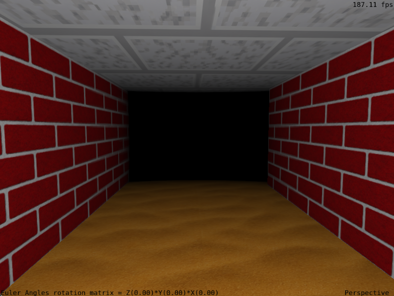
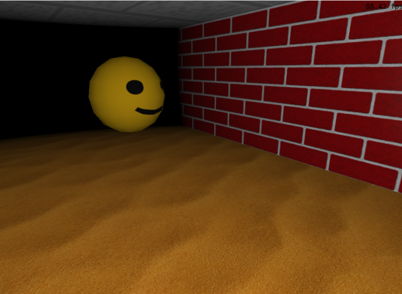

# Computação Gráfica e Visualização I (INF01047) - INF/UFRGS

NOMES:
João Pedro Müller Alvarenga
Lucas Kazuo Okano - 216888

# Um parágrafo descrevendo a aplicação que foi desenvolvida.

O jogo consistem em um labirinto onde existem ratos e uma smile em formato de esfera.
O jogador pode andar pelo mapa se batendo com os ratos e no momento em que enconsta no smile o jogo acaba.

# Parágrafo listando as contribuição de cada membro da dupla para o trabalho;

João Paulo foi responsável pela estrutura inicial do projeto com a movimentação da câmera em terceira pessoa, modelo tridimencional do rato e suas instâncias assim como o movimento em curvas, colisões.

Lucas foi responsável pela aplicação das texturas, ajustes de iluminação, smile colocado aleatoriamente no mapa e animado, câmera vista de cima.

# Parágrafo curto indicando se a dupla fez uso do ChatGPT (ou alguma outra ferramenta similar, como Claude, Gemini, LLaMa, Github Copilot, OpenAI Codex, etc.) para desenvolvimento do trabalho, descrevendo como a ferramenta foi utilizada e para quais partes do trabalho. O parágrafo deve também incluir uma análise crítica descrevendo quão útil a dupla achou a ferramenta, onde ela auxiliou e onde ela não auxiliou adequadamente;

João Paulo: Eu usei a ferramenta de Ia Claude, na versão gratuita, e acredito que esse foi o meu maior problema, o uso de tokens da versão gratuita é muito restrito, então algumas tarefas que eu queria que a ia realizasse levavam até dois dias para ser feito, pois eu precisava mandar ela continuar o desenvolvimento a cada 5 horas que era o período em que eu ganhava mais tokens, fora a limitação da "inteligência" da ia que é mais restringida no modo grátis fazendo com que eu tivesse que fazer prompts extensos para detalhar as ações a serem realizadas e também muito retrabalho após o término da execução. Acho que a ferramenta é muito útil para tarefas simples ou "braçais" que levaria horas para o programadores como o setup inicial do programa, a estruturação do programa, e a instanciação de objetos, que ela resolve facilmente, entretanto tarefas mais difíceis, como configurações visuais, luz, textura, não são realizadas com precisão, e precisam de constante supervisão do programador.

Lucas usou principalmente o chatGPT que auxiliou bastante no desenvolvimento, porém tudo deve ser feito em pequenos passos, pois a ferramenta alucina e adiciona coisas que não foram pedidas juntamente. É muito útil para corrigir os bugs apresentados nos logs, é ruim para ajustar algum erro que se precisa explicar visualmente o que acontece (dado que o resultado do código é gráfico), porém isso vai mais na direção da dificuldade que é traduzir em palavras o que acontece com o programa.

# No mínimo duas imagens mostrando o funcionamento da aplicação;

# Um manual descrevendo a utilização da aplicação (atalhos de teclado, etc.);

W, A, S, D: movimentação do jogador.
Mouse: controla a direção da câmera que também é a direção frente do jogador.
TAB: alterna entre as câmeras de cima e POV.
ESPAÇO: HACK para retirar as paredes e achar mais fácil o SMILE.

# Explicação de todos os passos necessários para compilação e execução da aplicação;

mkdir build
cd build
cmake ..
cmake --build .
